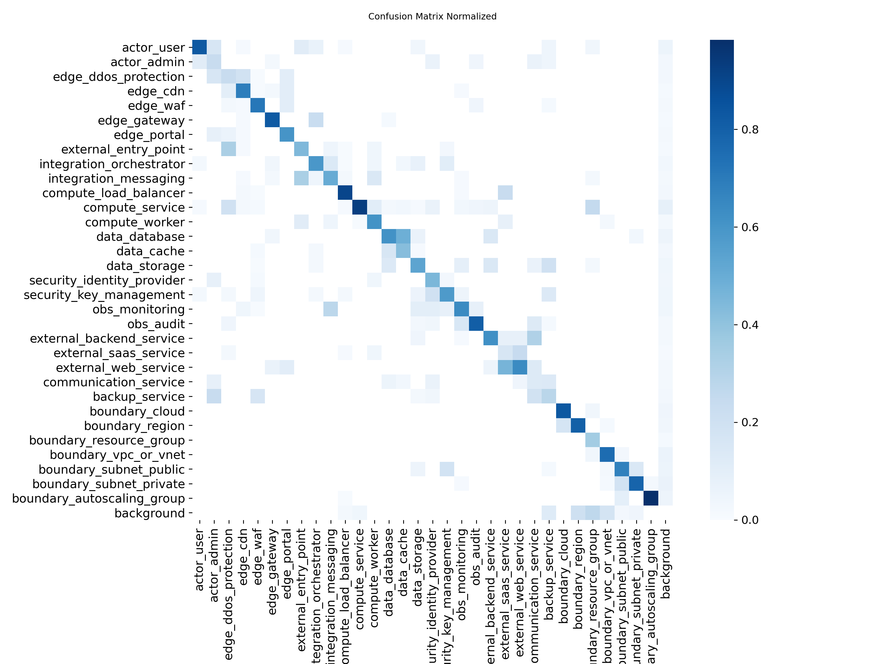
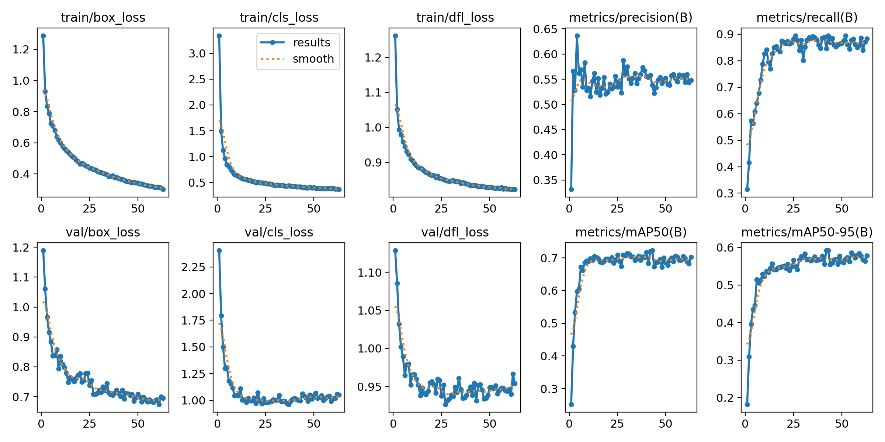
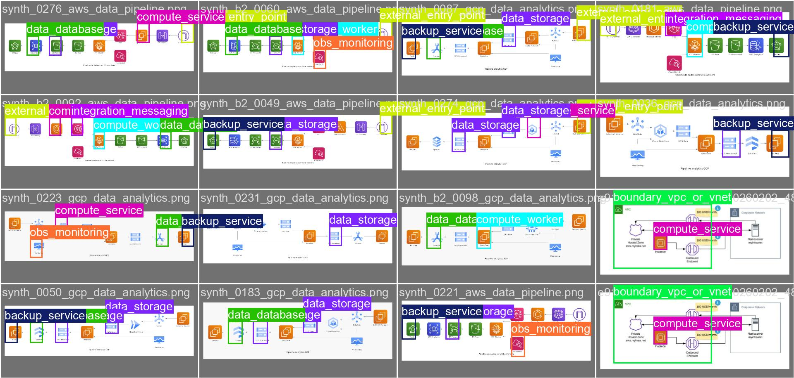
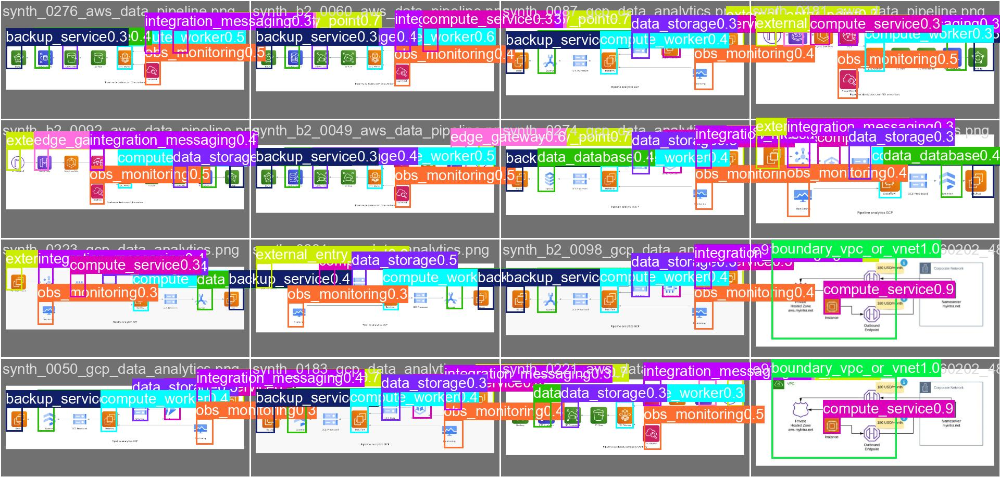

# STRIDE Architecture Analyzer

Detecção automática de ameaças de segurança em diagramas de arquitetura cloud (AWS, Azure, GCP), usando modelagem de ameaças STRIDE. Projeto desenvolvido para o Hackathon da Fase 5 (Privacidade, Segurança de Dados e Aplicações Práticas) da pós-tech FIAP.

Você faz upload de um diagrama de arquitetura (PNG/JPG) e o sistema devolve, em poucos minutos, um relatório completo em PDF com as ameaças STRIDE (Spoofing, Tampering, Repudiation, Information Disclosure, Denial of Service, Elevation of Privilege) aplicáveis a cada componente identificado, a severidade, o nível de concordância entre as fontes de análise, e contramedidas recomendadas.

## Como funciona — 3 camadas

```
Imagem do diagrama
        │
        ▼
┌───────────────────────────┐
│ Camada 1 — SLM            │  detecção de componentes (32 classes,
│  stride/analyzer.py       │  YOLOv8) + fluxos de dados/setas
│  slm/flows.py             │  (YOLO11-pose) + heurística STRIDE +
│                           │  base de contramedidas
└───────────────────────────┘
        │
        ▼
┌───────────────────────────┐
│ Camada 2 — Validação LLM  │  Claude e GPT-4o analisam a MESMA imagem +
│  (Claude ∥ GPT-4o)        │  componentes detectados, em paralelo e de
│                           │  forma independente uma da outra
└───────────────────────────┘
        │
        ▼
┌───────────────────────────┐
│ Camada 3 — Consensus      │  combina as 3 análises (SLM + Claude +
│  Engine                   │  GPT-4o), calcula o score de concordância
│  validation/consensus.py  │  (alta/média/baixa) e a severidade final
└───────────────────────────┘
        │
        ▼
  Relatório STRIDE em PDF (componentes + fluxos de dados)
```

As 3 fontes analisam o diagrama **de forma independente** — o SLM não valida a saída do Claude/GPT-4o via RAG nem nada parecido; cada uma chega à sua própria conclusão sobre os mesmos componentes, e é só na Camada 3 que os resultados são comparados e combinados. Quando as 3 concordam, a confiança da ameaça é "alta"; quando só uma fonte identifica algo que as outras não viram, a confiança fica "baixa" e fica sinalizado para revisão manual — isso é uma característica desejada do desenho, não um defeito: é o próprio motivo de usar 3 avaliadores independentes em vez de um só.

## Estrutura do projeto

```
hackathon-stride-ai/
├── api/                    # Backend FastAPI (orquestra as 3 camadas)
│   └── main.py             #   POST /analyze, POST /report, GET /health
├── app/
│   └── streamlit_app.py    # Frontend web (client HTTP da API)
├── slm/                    # Camada 1 — detecção de componentes (YOLOv8)
│   ├── generate_dataset.py #   gera o dataset sintético de treino
│   ├── predict.py          #   inferência do modelo de componentes
│   ├── flows.py            #   detecção de fluxos (setas) + travessias de fronteira
│   ├── weights/             #   pesos: stride_yolov8s (componentes) e
│   │                        #   stride_yolo11_pose (fluxos)
│   └── notebook-*.ipynb     #   notebook de treino executado no Kaggle
├── stride/
│   └── analyzer.py          # Heurística STRIDE + base de contramedidas
├── validation/               # Camada 2 (Claude/GPT-4o) + Camada 3 (consenso)
│   ├── claude_validator.py
│   ├── openai_validator.py
│   ├── consensus.py
│   └── common.py             #   prompt e utilitários compartilhados
├── report/                   # Geração do relatório em PDF
│   ├── generator.py
│   └── templates/stride_report.html
├── docs/
│   ├── training_results/     # Métricas e gráficos do treino do YOLO
│   └── fiap_test_architectures/  # Diagramas usados no teste end-to-end
├── dataset/synthetic/         # Dataset sintético gerado para o treino
└── requirements.txt
```

## Como rodar localmente

Pré-requisitos: Python 3.11+, chaves de API da Anthropic (Claude) e da OpenAI (GPT-4o).

No Windows, a geração de PDF (WeasyPrint) precisa do runtime GTK3 instalado — veja [aqui](https://github.com/tschoonj/GTK-for-Windows-Runtime-Environment-Installer/releases).

```bash
# 1. Criar e ativar o ambiente virtual
python -m venv .venv
.venv\Scripts\activate        # Windows
# source .venv/bin/activate   # Linux/Mac

# 2. Instalar dependências
pip install -r requirements.txt

# 3. Configurar variáveis de ambiente
copy .env.example .env        # Windows
# cp .env.example .env        # Linux/Mac
# edite o .env e preencha ANTHROPIC_API_KEY e OPENAI_API_KEY
```

Suba o backend e o frontend em dois terminais separados:

```bash
# Terminal 1 — API
uvicorn api.main:app --reload --port 8000

# Terminal 2 — interface web
streamlit run app/streamlit_app.py
```

Acesse `http://localhost:8501`, faça upload de um diagrama de arquitetura e clique em **Analisar ameaças STRIDE**.

## Camada 1 — treinamento do SLM (YOLOv8)

O modelo de detecção (YOLOv8s) foi treinado do zero para reconhecer **32 classes** de componentes de arquitetura cloud (atores, serviços de borda, computação, dados, segurança, observabilidade, integrações externas e fronteiras de confiança como VPC/subnet/autoscaling group). O dataset principal é o [`stride-architecture-components-v1`](https://huggingface.co/datasets/guillherms/stride-architecture-components-v1) do Guilherme Santos, baixado direto do Hugging Face Hub (`snapshot_download`) já com os splits `train`/`val`/`test` prontos. Um dataset sintético complementar, gerado localmente com a biblioteca `diagrams` (`slm/generate_dataset.py`), é opcionalmente mesclado só para cobrir 2 classes sem nenhum exemplo no dataset real (`actor_admin`, `integration_messaging`) e reforçar outras classes sub-representadas.

Treino executado no Kaggle (GPU T4 x2) — [notebook completo com os outputs reais](https://www.kaggle.com/code/gustavopln/notebook-stride-architecture-components?scriptVersionId=337310807), também versionado em `slm/notebook-stride-architecture-components.ipynb`. Parada antecipada (early stopping, patience=20) na época 63 de 100, com o melhor checkpoint na época 43:

| Métrica | Valor |
|---|---|
| mAP50 | 0,72 |
| mAP50-95 | 0,59 |
| Precision | 0,54 |
| Recall | 0,89 |

O recall alto (0,89) mostra que o modelo raramente deixa de detectar um componente presente no diagrama — importante para não deixar ameaças de fora da análise. A precision mais moderada (0,54) não é uniforme entre as 32 classes: o log de validação por classe mostra que ela é puxada pra baixo por um grupo específico de classes raras — `actor_admin` (13 instâncias, precision 0,26), `integration_messaging` (22, 0,27), `edge_portal` (10, 0,38), `compute_worker` (28, 0,40) — exatamente as classes que tinham poucos ou zero exemplos reais antes da mescla sintética. Recall alto nessas classes mostra que o modelo aprendeu a forma; precision baixa mostra que ainda confunde com classes visualmente parecidas, esperado com poucos exemplos reais para ensinar a diferença fina. Classes bem representadas (100+ instâncias) ficam com precision entre 0,70 e 0,76. Esse ruído é absorvido pelas Camadas 2 e 3, já que Claude e GPT-4o reavaliam cada componente contra a imagem original antes do relatório final — detalhamento completo por classe em `docs/training_results/results.csv`.

### Evidências visuais do treino



*Matriz de confusão normalizada: diagonal forte em praticamente todas as 32 classes — incluindo `actor_admin` e `integration_messaging`, que tinham zero exemplos antes da mescla sintética (a prova de que a correção do desbalanceamento funcionou). As confusões residuais concentram-se entre `actor_admin`/`actor_user` (ícones de pessoa visualmente similares) e no bloco de serviços externos.*



*Curvas de treino (63 épocas até o early stopping): losses de treino e validação estabilizam sem divergir — overfitting leve, sem sinal de colapso — enquanto precision/recall/mAP sobem e estabilizam.*

<p align="center">
  
  
</p>

*Batch de validação lado a lado: à esquerda, as anotações reais (ground truth); à direita, as predições do modelo com os scores de confiança — útil para inspecionar visualmente onde o modelo acerta e erra por classe.*

Demais gráficos (curvas P/R/F1 por limiar de confiança, batches de treino, `args.yaml` com a configuração completa) em `docs/training_results/`.

A taxonomia das 32 classes e imagens de apoio para desenvolvimento e testes tiveram como referência o dataset público de Guilherme Santos no Hugging Face (ver [Referências](#referências)).

## Fluxos de dados e travessias de fronteira

Além dos componentes (nós do grafo), o sistema também detecta os **fluxos de dados** (as setas do diagrama — as arestas), completando a cobertura STRIDE: no modelo clássico, fluxos de dados são um dos elementos analisados, tipicamente sujeitos a Tampering, Information Disclosure e DoS.

A detecção usa o modelo [YOLO11-pose publicado pelo autor do dataset de componentes](https://huggingface.co/guillherms/vision-architecture-analyzer-yolo11-pose) (treinado no dataset `stride-architecture-flows-v1`, das mesmas 4.190 imagens): cada seta vira uma detecção com 2 keypoints — origem e destino. O `slm/flows.py` então:

1. Casa cada ponta de seta com o componente detectado mais próximo (Camada 1), formando conexões `origem → destino` — alimentando o parâmetro `connections` reservado em `stride/analyzer.py` desde o início do projeto.
2. Cruza cada conexão com as fronteiras de confiança (`boundary_*`) detectadas no diagrama e sinaliza **travessias**: fluxo entrando na VPC, saindo de subnet privada, cruzando de subnet pública para privada (caso prioritário), etc.
3. Recomenda contramedidas específicas por tipo de travessia (base estática `FLOW_COUNTERMEASURES`, no mesmo padrão da base de componentes) — e o par zero trust (TLS interno + autenticação serviço-a-serviço) para fluxos internos.

O resultado aparece como seção própria no relatório PDF e no Streamlit (com as setas desenhadas sobre a imagem). A feature é **aditiva e tolerante a falha**: se os pesos do modelo de pose faltarem ou a detecção falhar, a análise STRIDE segue normalmente, apenas sem a seção de fluxos. Limitação conhecida: o modelo de pose detecta bem setas sólidas, mas perde parte das linhas pontilhadas finas (ex. conexões de monitoramento) — a confiança de detecção de cada fluxo é exibida no relatório para dar essa transparência.

**Por que YOLOv8 para componentes e YOLO11-pose para fluxos?** São duas tarefas desacopladas com formatos de anotação diferentes — bounding box (retângulo por componente) vs. pose (2 keypoints por seta, origem/destino), que exige a variante `-pose` da arquitetura. O modelo de componentes foi treinado do zero para este projeto em bounding box; o de fluxos é de terceiros, publicado pelo autor do dataset apenas na variante YOLO11-pose (sem equivalente -pose em YOLOv8 disponível). As duas versões não trocam dados nem competem no mesmo pipeline — cada uma roda de forma independente sobre a mesma imagem, e os resultados só se encontram na geração do relatório, por casamento de coordenadas, nunca por compatibilidade de pesos ou arquitetura. YOLOv8 e YOLO11 são, na prática, duas gerações da mesma família Ultralytics (mesma API `ultralytics.YOLO`, mesmo formato `.pt`), diferindo em blocos internos da arquitetura — ganho incremental de desempenho, não mudança de paradigma. Retreinar o modelo de componentes em YOLO11 só para uniformizar a versão foi avaliado e descartado: exigiria revalidar do zero as métricas já reportadas (mAP50 0,72, recall 0,89) sem ganho concreto, dado que os dois modelos nunca interagem numericamente.

## Teste end-to-end

O pipeline foi validado com as duas arquiteturas de referência fornecidas no enunciado do hackathon (AWS multi-AZ e Azure API Management, em `docs/fiap_test_architectures/`), gerando relatórios completos em PDF com detecção de componentes, ameaças por categoria STRIDE, score de concordância entre as 3 fontes e contramedidas recomendadas para cada ameaça aplicável.

## Decisões de arquitetura e pivots

- **RAG → base de conhecimento estática**: o plano original usava LangChain + ChromaDB para recuperar contramedidas de uma base de documentos (OWASP, MITRE ATT&CK, CWE). Foi substituído por uma base estática em `stride/analyzer.py` (contramedidas genéricas por categoria STRIDE + específicas por classe de componente), suficiente para o escopo do hackathon e sem dependência de infraestrutura extra de indexação/embeddings.
- **Florence-2 → YOLOv8**: a detecção de componentes migrou de um modelo de visão-linguagem (Florence-2) para um YOLOv8 fine-tuned, mais leve e rápido para rodar em CPU na demo, com melhor controle sobre as classes de interesse.

## Stack

Python · FastAPI · Streamlit · Ultralytics YOLOv8 (componentes) + YOLO11-pose (fluxos) · Anthropic Claude · OpenAI GPT-4o · Jinja2 + WeasyPrint (PDF) · Pillow/diagrams (geração do dataset sintético)

## Referências

- SANTOS, Guilherme. **STRIDE Architecture Threat Modeling Dataset (AWS & Azure)**. Hugging Face Datasets, licença MIT. Disponível em: [huggingface.co/datasets/guillherms/stride-architecture-components-v1](https://huggingface.co/datasets/guillherms/stride-architecture-components-v1). Dataset com 4.190 imagens anotadas em 32 classes (formato YOLO) de componentes de diagramas de arquitetura AWS e Azure — base do treino do SLM de componentes deste projeto.
- SANTOS, Guilherme. **STRIDE Architecture Flows Dataset**. Hugging Face Datasets, licença MIT. Disponível em: [huggingface.co/datasets/guillherms/stride-architecture-flows-v1](https://huggingface.co/datasets/guillherms/stride-architecture-flows-v1). Mesmas imagens base, anotando as setas de fluxo (formato YOLO Pose, keypoints origem/destino).
- SANTOS, Guilherme. **Vision Architecture Analyzer — YOLO11 Pose**. Hugging Face Models, Apache 2.0. Disponível em: [huggingface.co/guillherms/vision-architecture-analyzer-yolo11-pose](https://huggingface.co/guillherms/vision-architecture-analyzer-yolo11-pose). Modelo treinado no dataset de fluxos acima — usado diretamente (pesos publicados) pela detecção de fluxos deste projeto (`slm/flows.py`).

## Autor

Gustavo — [github.com/gustavopln/hackaton-fiap-stride-ai](https://github.com/gustavopln/hackaton-fiap-stride-ai)
